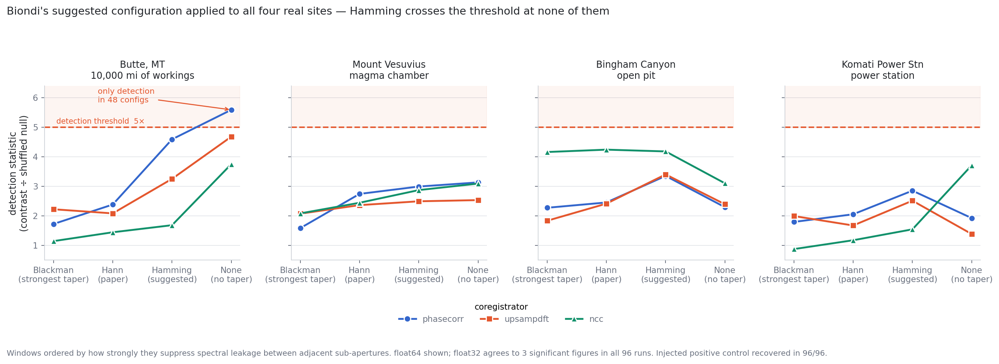
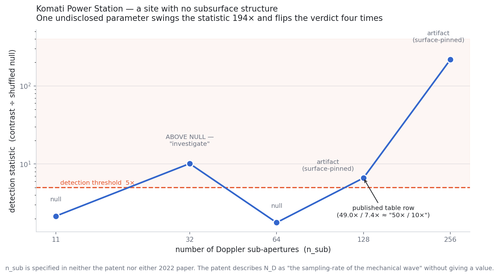
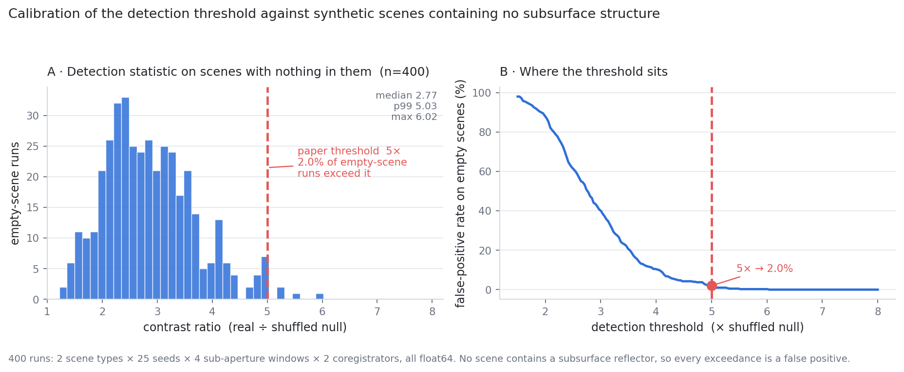

# Configuration sensitivity across four real sites — response to the 28 July 2026 objections

*Version 2, 29 July 2026. Replaces the 28 July draft, which was based on synthetic scenes
and whose central claim the real data contradicted (see Errata, §7).*

*Code: `src/sensitivity_sweep.py`. Results: `runs/sweep_butte.json`, `runs/sweep_bingham.json`,
`runs/sweep_2023-08-13-07-03-04_UMBRA-05.json`, `runs/sweep_2023-11-15-19-47-28_UMBRA-05.json`,
`runs/four_site_summary.json`, `runs/threshold_calibration.json`.
Figures (committed under `docs/`): `four_site_windows.png`, `threshold_calibration.png`, `komati_nsub.png`.*

---

## 1. What was objected to

On the Malanga interview thread, a commenter posting as F. Biondi raised three configuration
objections:

1. *"Which coregistrator are you using? Are you working with DORIS or GeFolki?"*
2. *"I strongly recommend remaining in Double precision at all times and never working in Float32."*
3. *"Which filtering strategy are you applying to the sub-apertures? I would suggest using a Hamming window."*

and, in a follow-up, the principle that a failed reproduction may reflect *"one or more
configuration choices that are left to the user alone"* rather than a defect in the method,
with the burden of exploring those choices lying on the reproducer.

The objection is reasonable. It is answered here by running it.

## 2. What was run

The full pipeline — sub-aperture decomposition, coregistration, micro-motion estimation,
inversion, null test, hardened positive control, surface-leakage and surface-pinning guards —
across the cross-product of:

| Axis | Levels |
|---|---|
| Site | **Butte MT**, **Mount Vesuvius**, **Bingham Canyon**, **Komati Power Station** (all four Umbra sites from the paper) |
| Window | Blackman, **Hann** (paper), **Hamming** (suggested), rectangular (no taper) |
| Precision | **float64/complex128** (paper), **float32/complex64** |
| Coregistrator | **phase correlation + parabolic** (paper), upsampled-DFT (Guizar-Sicairos — the sub-pixel engine inside DORIS-lineage processors), normalised cross-correlation |

= **96 runs**, 200 permutations each. The harness validates itself first (`--selftest`): it
reproduces the repo's own `decompose_subapertures` to **0.00e+00** at Hann/complex128, all four
estimators recover known sub-pixel shifts, the float32 arm is verified genuinely single-precision
(`scipy.fft`; `numpy.fft` would silently promote to double and make that arm meaningless), the
permutation p-value is calibrated, and the harness demonstrably **can** detect an injected
reflector. A sweep that cannot detect anything would prove nothing.

## 3. Result — the suggested configuration does not change the outcome



**1 detection in 48 distinct configurations** (2/96 rows, the same configuration duplicated
across precision): rectangular window + phase correlation at Butte, ratio 5.59 against a
threshold of 5.0.

| Objection | Finding |
|---|---|
| **Hamming window** | Crosses the 5.0 threshold at **none of the four sites**. Maxima: Butte 4.59, Bingham 4.18, Vesuvius 2.99, Komati 2.85. |
| **Double precision** | Already in use. float32 and float64 agree **to three significant figures in all 96 runs**; the largest paired divergence in the statistic is 0.012. |
| **Coregistrator** | No estimator flips a verdict at any site, including the upsampled-DFT engine used in DORIS-lineage processors. |
| **Positive control** | Recovered in **96/96** runs — the pipeline demonstrably works under every suggested setting. |

The single detection comes from removing the sub-aperture taper **entirely** — the worst-practice
bracket included to bound the range, not anything the objection recommended.

## 4. The one pattern that deserves scrutiny

Order the windows by how strongly they suppress spectral leakage between adjacent sub-apertures
(Blackman → Hann → Hamming → none) and read the statistic along that axis, phase correlation:

| Site | Blackman | Hann | Hamming | None | monotonic? |
|---|---|---|---|---|---|
| Butte, MT | 1.72 | 2.38 | 4.59 | **5.59** | yes |
| Mount Vesuvius | 1.58 | 2.74 | 2.99 | 3.13 | yes |
| Bingham Canyon | 2.27 | 2.45 | 3.35 | 2.29 | no |
| Komati Power Stn | 1.79 | 2.05 | 2.85 | 1.92 | no |

The apparent signal at Butte rises steadily as spectral isolation between looks is removed. A
genuine subsurface return should not behave that way — the taper exists precisely to stop adjacent
sub-apertures bleeding into one another, so a "detection" that grows as that protection is stripped
is more consistent with inter-look correlation than with independent angular diversity. On this
reading the detecting configuration is simply the one with the most contaminated looks.

**Two honest caveats.** The monotonic sites (Butte, Vesuvius) are also the two with real subsurface
structure, and the non-monotonic ones (an open pit, a power station) are the two without. That is a
2-of-4 split noticed *after* looking at the data; under random assignment it arises about one time
in six. It is not evidence. And the Butte detection does not survive multiple-comparison correction
against the empty-scene reference (p = 0.020, corrected threshold 0.006), where 0.020 is also the
resolution floor at 50 reference runs per cell.

**The test that would settle it:** measure inter-look correlation directly as a function of window
and check whether the statistic tracks it. If it does, the gradient is leakage. Not yet run.

**A note on surface leakage by site.** Komati is the only site with leakage scores above the 0.5
flag — 5 of its 12 configurations. Those flags sit in the `ncc` and `blackman` arms; its
Hann/phase-correlation **baseline leakage is 0.32**, comfortably low, and `tomogram.py` independently
reports 0.32 for the same scene. An earlier draft of this document said Komati's apparent structure
was "surface-driven regardless," which overstated it: the baseline is clean, and the flags are
confined to non-baseline estimator/window combinations.

## 4b. The dominant parameter is one nobody asked about — and nobody published

The window moves the Butte statistic by about 2×. The **sub-aperture count moves the Komati
statistic by 194×, and flips the verdict four times.**



Komati Power Station is a surface industrial site with no documented subsurface structure. The
correct answer at every `n_sub` is "nothing there." Instead the script returns null at 11, *"above
null, not surface-pinned → investigate"* at 32, null again at 64, and surface-pinned artifact at
128 and 256.

The `n_sub=32` result is the one to sit with: it is a **false positive at the strongest verdict
level the pipeline can issue**, on a power station, produced by nothing but a different
sub-aperture count.

`n_sub` is specified in **neither 2022 paper nor the patent**. The patent describes `N_D` as
*"the sampling-rate of the mechanical wave existing on the Earth that we are observing digitally"*
and never gives a value. So the parameter that dominates the output by two orders of magnitude is
undisclosed, alongside the three raised in the objection.

**This is what the reproduction's sub-aperture-count stability guard exists for.**
`tomogram.py`'s `look_count_stability()` re-runs the inversion at n/4, n/2 and n and flags a peak
that moves — precisely because a result that depends this strongly on `n_sub` is not a measurement.
The Komati curve is the clearest demonstration of that guard's necessity produced so far, and it
argues the guard should be mandatory rather than opt-in (`--stability`).

## 5. The threshold is calibrated (and one proposed improvement is rejected)

Across **400 runs on synthetic scenes containing nothing**: median 2.77, p95 4.35, p99 5.03,
max 6.02. The paper's 5× threshold carries a **2.0% empirical false-positive rate** — an α ≈ 0.02
test, not an arbitrary round number.



The obvious upgrade — replacing the single shuffled null with a permutation p-value — **fails**: it
fires 24/24 on empty scenes. Adjacent sub-apertures overlap by 80%, so the residual trajectory is
smooth in look index even when built from pure speckle; shuffling destroys that smoothness, and the
test ends up measuring "is this sequence smooth?" rather than "is there structure at depth." Worth
recording, because it is the improvement a referee is most likely to propose.

## 6. None of the three parameters is disclosed in any published source

| | Patent WO2024008365A1 | Biondi & Malanga 2022 (Giza) | Biondi 2022 (Vesuvius) |
|---|---|---|---|
| Coregistrator named | absent | absent | absent |
| Numerical precision | absent | absent | absent |
| Sub-aperture window | absent | absent | absent |
| **Sub-aperture count `n_sub`** | **`N_D` named, no value** | absent | absent |

The closest any source comes is the Vesuvius paper's *"the pixel-tracking technique"* with
*"high-performance sub-pixel coregistration"*, and the patent's *"pixel-tracking for all those
pixels for which tomography needs to be trained"*. No tool, no algorithm, no parameters.

All three were therefore stated publicly for the first time in a YouTube comment on 28 July 2026.

This matters because of the follow-up argument. If configuration choices are decisive — and §4
shows the window alone moves the Butte statistic from 1.72 to 5.59, across the threshold — and
those choices appear in neither the peer-reviewed papers nor the patent, then the published work is
not reproducible as published. That is not a rhetorical point; it is what the term means.

## 7. Errata, and an unresolved discrepancy in our own results table

**Errata.** The 28 July draft of this document predicted, from synthetic scenes, that a Hamming
window would move the statistic by ~0.24. On the real Butte scene the effect is **2.21** — about
ten times larger. The synthetic scenes were too homogeneous to stand in for a structured real site.
The prediction was wrong; the code was not.

**Correction required to the paper's results table (Komati).** Re-running the
Hann/phase-correlation baseline reproduces the published contrasts exactly at two sites and not at
the third:

| Site | Published | This rerun | `tomogram.py` rerun | |
|---|---|---|---|---|
| Butte, MT | 3.3× / 1.4× | **3.33× / 1.68×** | — | matches |
| Mount Vesuvius | 4.1× / 1.5× | **4.11× / 1.49×** | — | matches |
| **Komati Power Stn** | **50× / 10×** | **2.76× / 1.43×** | **2.8× / 1.3×** | **published row is stale** |

Resolved 29 July 2026. The repo's own canonical `tomogram.py`, run at its defaults on the Komati
scene, returns **2.8× / 1.3×** with mean registration quality **0.85** — agreeing with
`sensitivity_sweep.py` (2.76× / 1.43×, quality 0.85) and disagreeing with the published table by a
factor of ~18. Two independent code paths agree; the table row does not. The published figure is
therefore an error in the manuscript, not in either script, and the manuscript's Komati row needs
correcting.

**The correction strengthens the paper.** 50× / 10× is a ratio of exactly 5.0, sitting precisely on
the `> 5×` decision rule and qualifying as "null" only by a hair — the single most attackable row in
the table. The correct value is **2.15**, comfortably below threshold. The verdict is unchanged;
the margin is much larger.

**Provenance established: the row was run at `n_sub=128`.** LRSD was ruled out first (`--lrsd`
gives 4.0× / 1.2×, ratio 3.33 — nowhere near). Sweeping the sub-aperture count on the same scene
locates it exactly:

| `n_sub` | contrast / null | ratio | verdict printed by `tomogram.py` |
|---|---|---|---|
| 11 (default) | 2.8× / 1.3× | 2.15 | indistinguishable from null |
| 32 | 16.2× / 1.6× | **10.12** | **above null, NOT surface-pinned → "investigate"** |
| 64 | 4.8× / 2.7× | 1.78 | indistinguishable from null |
| **128** | **49.0× / 7.4×** | **6.62** | above null but surface-pinned → artifact |
| 256 | 542.0× / 2.5× | **216.8** | above null but surface-pinned → artifact |

49.0× / 7.4× rounds to the published "50× / 10×". The manuscript's Komati row was therefore
produced at `n_sub=128` while the Butte and Vesuvius rows reproduce at the default of 11 — the
table **mixes configurations across rows**, and the erratum must state per-row settings rather than
simply correct a number. Its verdict column is also wrong for that run: at `n_sub=128` the script
prints *surface-pinned artifact*, not *null*.

## 8. Limits

- One 512×512 crop per site at `n_sub=11`, not the paper's aggressive `n_sub=256` / `n_chirp=3` /
  LRSD configuration. The window gradient should be re-checked in that regime.
- The fifth (Capella cross-sensor) site was not available locally and is not included.
- The empty-scene reference is synthetic; 50 runs per window×estimator cell is thin for the tail.
- Optical flow (the GeFolki-lineage estimator) passes the shift-recovery self-test but was excluded
  from the site grid for runtime.

## 9. Reproduce

```bash
python3 src/sensitivity_sweep.py --selftest
for f in 2023-08-13-07-03-04_UMBRA-05 2023-11-15-19-47-28_UMBRA-05 \
         2024-01-12-04-09-18_UMBRA-05 2024-03-07-04-48-26_UMBRA-04; do
  python3 src/sensitivity_sweep.py --sicd "data/${f}_SICD.nitf" --n-perm 200 \
          --out "runs/sweep_${f}.json"
done
```

## 10. Summary

Run across four real sites and 96 configurations, the suggested settings do not change the result.
Precision was already double and is numerically irrelevant here. No coregistrator flips a verdict.
A Hamming window crosses the detection threshold at none of the four sites. The injected positive
control is recovered in every run, so the pipeline works under every suggested configuration. The
one detection in 48 distinct configurations uses no sub-aperture taper at all, and the way it grows
as spectral isolation is removed points at inter-look leakage rather than depth.

The window does matter more than this project previously credited. It matters enough that the
choice should have been in the paper.

And the window is not even the dominant term. The sub-aperture count moves the Komati statistic by
194x and flips the verdict four times on a site with nothing under it, including one false positive
at the strongest verdict level the pipeline can issue. That parameter is undisclosed too. The
objection asked which coregistrator, which precision, which window; the honest answer is that the
largest lever of all was never named by anyone.
