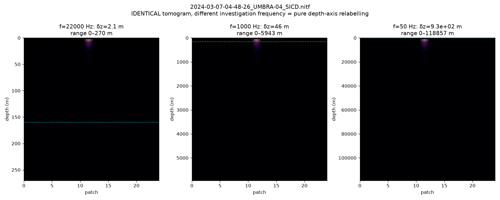

# No Reproducible Evidence for Deep Subsurface Structures Beneath the Giza Plateau: A Pre-Registered Reproduction of Single-Pass SAR Doppler Micro-Motion Tomography, and an Audit of Its Published Imagery

**Hassan Foreman** — independent researcher
Preprint v6.1 — DRAFT, 7 October 2026 (v6 draft 27 Sep; revised after an adversarial panel review, §10). Supersedes v5 (August 2026). Under review at PCI Archaeology (#1130). Not yet peer reviewed.
Code, data identifiers, pre-registrations and result files: https://github.com/Hassanforeman/subsurface-sar-tomo (Zenodo DOI 10.5281/zenodo.21065675).

> *Draft status.* Wording will change in response to reviewers. Items marked [TODO] are open. Figure slots name the pipeline output that fills them. Claims point to a script and a result file in the repository (Appendix A); where a file is not yet in the repository this is stated.

---

## Abstract

Between 2022 and 2026, F. Biondi and C. Malanga reported that Doppler sub-aperture "micro-motion tomography" of single spaceborne SAR acquisitions reveals structures hundreds of metres to kilometres beneath the Giza plateau: paired shafts to ~648 m, spiral ramps, large chambers and, in 2026, a buried "second Sphinx" at Giza. The 2022 article was retracted by *Remote Sensing* on 10 August 2026 for unspecified "serious methodological flaws and statistical errors".

Working from the authors' paper and patent, I reconstructed the method, added controls it omits, and applied it to free X-band spotlight data from two sensors over six sites, including three acquisitions of Giza. Giza tests were pre-registered in the public repository; deviations from those pre-registrations are listed in Table 5. The findings, and their limits, are:

1. **The depth axis is a label, not a measurement.** The patent's steering matrix is a discrete Fourier transform. Evaluated with real Umbra orbits, the paper's single-pass steering wavenumbers form a ladder uniform to a few parts in 10⁵ (as expected for near-linear platform motion), so the operator is a DFT. Its metre scale is set by an unmeasured "investigation frequency" or sound wavelength: the same pixels read as 34 m or 1,110 m, and with one fixed value the three Giza acquisitions are put on different depth scales.
2. **The reconstruction returns the same shallow peak everywhere, including from pure noise.** Across six sites and two sensors, no run clears the decision rule, and the peak sits at 1.2–1.9 resolution cells. In this reconstruction (adjacent-pair tracking accumulated into a trajectory) a sufficient generating mechanism is shown: accumulated registration noise is a random walk, and a degree-2 detrend followed by a DFT places its expected peak at 1.68 cells, reproduced with no satellite data. The mechanism is specific to accumulation; whether the original pipeline accumulates is undisclosed. **A pre-registered falsification condition for it was met on two of three Giza scenes, including the pre-registered primary**: there, the peak stays near the surface after the running total is removed. That residual is not an ordering effect (pre-registered test) and remains unexplained.
3. **At tile scale (13–50 m), fields of hundreds of excavated mastaba shafts are not distinguished from bare plateau** (standardised differences −0.10 and −0.03 on the two primary scenes; a third scene, with a geolocation error, was excluded by a rule fixed before the run). The test detects a planted displacement (|d| ≈ 2) but could not detect cemetery effects smaller than roughly 0.2–0.5 standard deviations, so this is an absence of evidence at that scale, not a demonstration of no effect.
4. **Shape.** A pre-registered shape statistic gives 0/8, 4/8 and 0/8 treatments against a 5/8 rule. Three of the eight treatments are mathematically identical, a design flaw found after the run; on six distinct treatments one scene (02-08) is "architecture-like" on 4/6. Its bright blobs are no more elongated than those of pure noise. It is reported as an unexplained positive of a flawed statistic, not as a null.
5. **The recognisable geometry of the published imagery is not derivable from the displayed tomography.** In all 16 "tags association" figures of the 2022 paper the geometry is a CAD model's, linked to unscaled 2-D heat maps by hand-placed tags; 4 of 16 heat maps are overlaid on drawings of the known interior. The 2026 "second Sphinx" presentation builds its 3-D sphinx from four unscaled 2-D heat maps, and its own pipeline slide lists an image-to-image GAN, face-landmark and face-embedding tools, golden-ratio canon grids and dialogue with Grok and Gemini.

The surface-motion measurement at the method's front end is a real technique for strongly driven structures; nothing here shows it can image the subsurface. This is a critique of method and mathematics.

**Keywords:** synthetic aperture radar; Doppler tomography; micro-motion; reproducibility; pre-registration; null result; Giza; image provenance.

---

## 1. The claims under examination

I restate the claims as fairly as I can from the 2022 paper [1], the lapsed patent WO2024008365A1 [3] (the fullest public method disclosure), and the 2025–2026 presentations [4, 5]:

- **C1.** Microwaves do not penetrate rock; instead ambient seismic energy makes the ground vibrate, and the subsurface "becomes transparent like a crystal" when observed through surface micro-motion.
- **C2.** Splitting the azimuth (Doppler) spectrum of one SAR image into sub-apertures and tracking sub-pixel shifts between them recovers that vibration field.
- **C3.** A steering matrix A(K_z, z) focuses these observations in depth, giving 3-D tomograms with depth resolution δz = λR/2A, where λ = v/f is a seismic wavelength.
- **C4.** Applied at Giza, the method reveals paired cylindrical shafts to ~648 m, spiral structures, large chambers and, in 2026, a buried second Sphinx west of the Western Cemetery; applied elsewhere, it is said to image the Gran Sasso laboratory at ~1.4 km.
- **C5.** More than 200 acquisitions from four satellite operators return the same structures, which is presented as independent confirmation.

My standard throughout: a result counts as a detection only if it exceeds a null built from the same pipeline, survives controls fixed in advance, and corresponds to independent ground truth.

## 2. Data and reproduction method

**Data.** All scenes are free, openly licensed X-band spotlight products (Umbra and Capella Open Data, CC-BY 4.0) [12]. Six sites were analysed:

- **Giza plateau**, three Umbra acquisitions: 2023-02-07 (UMBRA-05); 2023-02-08 (UMBRA-04); 2023-03-08 (UMBRA-04, the pre-registered primary).
- **Butte, Montana:** densely mapped underground mine workings [13].
- **Bingham Canyon:** an open pit with no subsurface void.
- **Komati** (power station).
- **Cairo** (Capella).
- **Mount Vesuvius:** the authors' own published site [2].

Exact scene identifiers are listed in the repository.

**Pipeline (a reconstruction, not the authors' code).** The authors' sub-aperture count, overlap, taper, tracking estimator and depth-scale settings are not disclosed; these were chosen as follows and are the conditions of every result here:
- Doppler sub-aperture decomposition: 11 looks, 80% overlap, Hann taper.
- Adjacent-pair sub-pixel tracking (phase correlation) of 64 × 64 patches, **accumulated into a trajectory** (my reading of the patent's block 7).
- Degree-2 detrend; analytic-signal step; depth focus by DFT, 300 bins.

Table 1 maps the patent's processing blocks to this implementation, block by block, with the choices above wherever the patent is silent.

*Table 1 — the patent's disclosed processing chain (WO2024008365A1, Fig. 0.5, blocks 1–11) and the corresponding component of this reconstruction (module.function in src/).*

| Disclosed step | This reconstruction | Where the patent is silent |
|---|---|---|
| SLC image; 2-D DFT (blocks 1–2) | sarpy SICD reader; FFT inside the sub-aperture stage | — |
| Doppler sub-apertures (master/slave) and range sub-bands (blocks 3–6) | subaperture.decompose_subapertures (sensitivity_sweep.decompose_subapertures_w for taper choice); subaperture.multichromatic_subapertures for range sub-bands | look count, overlap, taper; range sub-bands used only in the §5.1 Butte run at the authors' settings |
| Pixel tracking between sub-apertures (block 7) | micromotion.adjacent_trajectory: adjacent-pair phase correlation, **accumulated** (cumulative sum); micromotion.detrend; optional micromotion.lrsd_denoise | estimator; adjacent-pair vs common reference; whether displacements are accumulated (my reading; see §4.2 and test I) |
| Raw tomographic complex vectors (block 8) | per-patch detrended residual trajectory, made analytic (tomogram.analytic1d) | detrend degree; patch size and count |
| Steering matrix = DFT depth focus (block 9) | tomogram.steering (DFT basis) and tomogram.invert_patch (power) | number of depth bins |
| Tomogram, geocoded in depth (blocks 10–11) | depth profile per patch; tomogram.metric_depth_axis (axis label δz = vR/2Af only) | velocity v and frequency f are free inputs (§3.3) |

Controls added: an alignment null that preserves each patch's depth profile; positive controls planted as displacement in the image before tracking; a surface-pinning guard in resolution cells; sub-aperture-count stability. Every stage has a synthetic self-test.

**Pre-registration.** From August 2026, each Giza test was specified in a document committed to the public repository before that test was run (statistic, thresholds, controls, aggregation rule, interpretation). The timestamps are git commit times, which are author-controlled; no external registry was used (future pre-registrations will be deposited on OSF). Result sections were appended after each run. The five non-Giza sites were analysed before any Giza pre-registration existed and are context only. **Deviations are listed in Table 5.** Two analyses (§§3.2, 4.1) are descriptive and were not pre-registered.

*Table 5 — deviations from pre-registration.*

| Item | Pre-registered | What happened |
|---|---|---|
| Giza primary scene | 2023-03-08 | 2023-02-07 analysed first (smaller file finished downloading first); 03-08 analysed later. A protocol deviation. |
| E5 geometry sweep (Giza) | "peak stable to ±0.05 cells across 13 configurations" | Not run on Giza. Not reported. A different, non-pre-registered row (fixed-window spread) was scored in its place in the August record; that substitution is withdrawn. |
| Falsification (ii) "a peak that survives removal of the cumulative sum" | listed | Met on 2 of 3 scenes (02-07, 03-08). The August record's "None of the four falsification conditions was met" was wrong and is withdrawn (§4.3). |
| Mines and Gran Sasso (Parts A, B) | pre-registered | Not run (no suitable free scenes obtained). Reported as not run. |
| Shape metric (8 treatments, 5/8 rule) | as registered | Three treatments are identical by construction; see §5.4. |
| Known voids (test G) | 2 plateau controls; 3 scenes | One plateau box dropped (built compound) and scene 02-08 made secondary (geolocation error), both from an amplitude-only check committed before any tomogram. |
| Prior exposure | — | Whole-scene Giza depth slices (all tiles, including cemeteries) were viewed in August, before tests G and the shape metric were registered. |

## 3. The operator: depth is a Fourier bin with a free label

### 3.1 The steering matrix is a DFT
The patent states that the steering matrix "represents the best approximation of a matrix operator performing the Digital Fourier Transform (DFT) of Y" [3]. The depth tomogram is therefore the power spectrum of each patch's processed trajectory; the reference implementation agrees with direct DTFT evaluation to one part in 10¹⁵.

A DFT does not by itself create a confident peak: white noise has a flat expected spectrum. What produces the systematic shallow peak in this reconstruction is what is fed to the DFT — an accumulated, detrended trajectory (§4). Super-resolution inverters do not change this: Capon and MUSIC applied to the same trajectories peak at the same depth as the plain transform (Giza: 1.75, 1.99 and 1.75 cells).

### 3.2 The paper's single-pass K_z ladder is a DFT on real orbits
The 2022 paper writes K_z = 4πB⊥/(λ_s r sin θ). In a single pass, the only available "baseline" is the platform's own displacement across the aperture. I evaluated the paper's form with B⊥ taken as that displacement projected perpendicular to the line of sight (the reading also used by an independent reimplementation [7]), from each Umbra product's orbit polynomial, for the 11-look bank.

*Table 2 — the paper's steering wavenumbers on real Umbra geometry.*

| Scene | Processed aperture | LOS-perpendicular displacement span | of which true cross-track | CV of ΔK_z | Depth repeat per metre of λ_s |
|---|---|---|---|---|---|
| 02-07 | 1.27 s | 6,510 m | 1.05 m | 3.8 × 10⁻⁶ | 292 m |
| 02-08 | 1.18 s | 6,059 m | 0.77 m | 2.2 × 10⁻⁶ | 240 m |
| 03-08 | 5.04 s | 25,784 m | 16.0 m | 2.3 × 10⁻⁵ | 71 m |

The LOS-perpendicular displacement is dominated by along-track motion (kilometres). The true cross-track component — the quantity that sets elevation resolution in multi-pass SAR tomography — is of order a metre, the same order as the ~0.6 m single-pass baseline reported by Pomposi [8]; the two analyses describe different quantities and do not conflict.

Consequences:
- For near-linear motion the ladder is necessarily near-uniform, so, as implemented, the operator is a DFT and depth is a Fourier bin. This is a property of the geometry, not a finding about the ground.
- The depth axis repeats every λ_s·r·sinθ/(2ΔB⊥), and λ_s is not measured. With λ_s = 0.48 m the repeat is 140 / 115 / 34 m; with λ_s = 3.8 m it is 1,110 / 912 / 270 m. With one fixed λ_s, the three acquisitions put the same ground on different depth scales.

I cannot evaluate the authors' own (undisclosed) look centres. Every bank formed from the published formula and these state vectors has a near-uniform ladder, and depth remains proportional to 1/λ_s.

### 3.3 The 22 kHz "investigation frequency" is not in the data
The patent synthesises depth at f ≈ 22 kHz. Ambient ground motion is overwhelmingly below ~100 Hz, and the Nyquist rate of a look sequence spanning one to five seconds is of order hertz. f enters only as a final axis scale (δz = vR/2Af); it never touches the inversion.

*Figure 1 — one tomogram, three frequencies.* The identical Butte tomogram (Umbra, 2024-03-07; 24 patches; 256 looks, the §5.1 authors'-settings run — the axis span of 270 m at δz = 2.1 m implies 256 looks) rendered with f = 22,000, 1,000 and 50 Hz: δz = 2.1, 46 and 930 m, so the same feature (about two cells down) reads ~5 m, ~100 m or ~2,000 m. The data are unchanged; only the axis label rescales (δz = vR/2Af, v = 6,000 m/s). The dashed line marks 160 m, the approximate Butte mine-pool level cited in §5.1. Produced by src/tomogram.py (`_plot_fcompare`); file docs/figures/fig1_fcompare_butte.png (copy of runs/fcompare_2024-03-07-04-48-26_UMBRA-04_SICD.nitf.png, generated 3 Sep 2026).

The method as disclosed therefore provides no way to check the metre values reported for Giza.

**Could dispersion or resonance supply a depth scale?** Established passive-seismic methods do obtain depth from ambient vibration, but each needs something a single SAR pass does not supply. Surface-wave methods (spatial autocorrelation [17]; multichannel analysis of surface waves [18]; ambient-noise interferometry [19]) measure phase velocity as a function of frequency across an array of sensors, then invert that dispersion curve for a velocity–depth profile; depth sensitivity comes from wavelength, so the frequency axis must be measured, not assumed. The H/V spectral-ratio method [20] gives a resonance frequency, which becomes a depth only with an independently known shear-wave velocity, and recording guidelines call for several minutes or more of data, longer for lower frequencies [21]. A single SAR pass records one to five seconds at one look geometry: its frequency resolution is of order 1/T (about 0.2–1 Hz), it has no array of independent sensors at known spacing, and it supplies no velocity. None of these routes is available to it, and the patent's fixed 22 kHz and assumed velocity are not a substitute for them.

## 4. A sufficient generating mechanism (in this reconstruction)

### 4.1 What the tracked increments carry
Each tracked increment comes from registering two sub-looks. Look-to-look magnitude similarity on the three Giza scenes:
- adjacent looks (80% spectral overlap): 0.58–0.71, about what the same filter bank gives for pure synthetic speckle (0.55–0.61);
- looks that share no spectrum: 0.06–0.18, the speckle floor.

This is largely an identity of how the looks are cut: similarity tracks spectral overlap. It shows that the increments are carried by the filter-bank overlap; it does not, by itself, show that the ground is incoherent. Magnitude correlation is used; complex coherence and the estimator's correlation-peak height are owed (§11).

### 4.2 A running total of noise is a random walk, and the detrend fixes the peak
The trajectory is the running total of the increments (`np.cumsum`). A running total of noise has a random-walk spectrum. After a degree-2 detrend, its DFT peak sits at a position fixed by the polynomial order. The expected tomogram is a parameter-free quadratic form,

  E[P(z)] = f(z)ᴴ · H (I − P_d) C (I − P_d)ᵀ Hᴴ · f(z),

with C_ij = min(i, j) + 1 (random-walk covariance), P_d the degree-d polynomial projection, H the analytic-signal operator and f(z)_k = exp(−i K_k z) the DFT steering. Its argmax, evaluated numerically (src/derive_depth_constant.py), is 1.680 cells at degree 2 (0.869 and 2.474 at degrees 0 and 4). Monte-Carlo walks with no image and no SAR processing give 1.69 ± 0.02 for series lengths 11 to 128. Real sites land at 1.2–1.9 cells. Contrast also scales with the walk: it rises 73× as the series lengthens from 11 to 128 samples while the increments stay flat (1.1×); at 128 sub-apertures, an input with no scene returns more contrast than a real one (274.85 against 128.64).

**Scope.** This mechanism exists only where displacements are accumulated. A common-reference tracker (each look registered to one reference) does not accumulate; an independent reimplementation using that route [7] supports the DFT/free-scale and no-discrimination findings but not this mechanism. Whether the original pipeline accumulates is not disclosed. A pre-registered common-reference variant of this pipeline (test I: each look registered to the centre look; per-scene control with a planted 0.5-px shift) could not be evaluated: on all three Giza scenes 0 of 24 patches recovered the planted shift, because looks more than about two steps apart share almost no spectrum and the scenes lack persistent scatterers to bridge them (tracking error 0.06–0.2 px next to the reference, 0.4–18 px further away). On these data, therefore, a full-aperture trajectory can only be built by chaining adjacent steps. This does not establish how the original pipeline tracks, nor how common-reference tracking behaves on other sensors or longer dwells. In synthetic checks, common-reference tracking also produced shallow peaks from tracking error alone, so a shallow peak is not diagnostic under either route (RESULTS_COMMON_REFERENCE_2026-10-07.md).

### 4.3 The pre-registered falsification test, and what remains unexplained
The August pre-registration listed as a falsification condition "a peak that survives removal of the cumulative sum". Removing the running total (series length and steering unchanged):
- at Bingham Canyon and Cairo the peak leaves the surface (1.66 → 2.83 and 1.69 → 4.76 cells);
- at Giza it does so on one scene (02-08: 1.67 → 3.83) but **stays within the 2-cell guard on 02-07 (1.75 → 1.88) and on the pre-registered primary 03-08 (1.77 → 1.95). The condition was met on two of three Giza scenes.** Accumulation is therefore sufficient to generate the artifact but is not shown to be necessary there.

A later pre-registered test (H) asked whether the residual reflects the *order* of the increments (1,000 look-order shuffles per scene; anomaly = below the 5th percentile). Result: 0 of 3 anomalous (10th, 56th, 12th percentiles); increments are not serially correlated (lag-1 +0.10, −0.13, +0.02). The residual is not an ordering or smoothing effect. It is not resolved: the per-scene nulls pin only 13–16% of the time, so two of three pinned scenes has probability ≈ 0.05 under them, and both lean surface-ward. **It is reported as an unexplained residual.** All three scenes remain detection nulls.

## 5. Results on real data

### 5.1 Six sites, no run clears the rule
*Table 3 — decision ratio (contrast relative to the alignment null; rule ≥ 5×) at n_sub 11, Hann taper; raw contrast for reference only. Each site was run at 8 sub-aperture counts (11–128); the Giza row is 2023-02-07.*

| Site | Sensor | Decision ratio vs alignment null (n_sub 11) | Raw contrast (Hann; reference only) | Runs clearing rule (of 8) |
|---|---|---|---|---|
| Giza 02-07 | Umbra | **3.67** | 6.06 | 0 |
| Bingham Canyon | Umbra | 2.40 § | 3.87 | 0 |
| Butte | Umbra | 1.53 § | 3.33 | 0 |
| Komati | Umbra | 1.88 § | 2.76 | 0 |
| Cairo | Capella | 1.76 † | 2.75 | 0 |
| Vesuvius | Umbra | 2.85 ‡ | 4.11 | 0 |

Sources: Giza, docs/PREREGISTRATION_GIZA_2026-08-13.md; Bingham, docs/RESULTS_2026-07-31_FIVE_SITE.md §5; Butte, docs/SENSITIVITY_RESPONSE_BIONDI.md E4; Komati, ibid. E3. ‡ Re-run 7 Oct 2026 from a fresh download (runs/followup_nsub_2023-11-15-19-47-28_UMBRA-05_SICD.nitf.json); it reproduces the July raw contrast exactly (4.11), peak 1.66 cells, surface-pinned. † Re-run 11 Oct 2026 from a fresh download (runs/followup_nsub_CAPELLA_C13_SP_SICD_HH_20241123062737_20241123062813.ntf.json); it reproduces the July raw contrast exactly (2.75); alignment null 1.57; peak 3.6 m = 1.71 cells, surface-pinned. § Re-run 11 Oct 2026 from fresh downloads (runs/followup_nsub_2024-01-12-04-09-18_UMBRA-05_SICD.nitf.json; runs/followup_nsub_2023-08-13-07-03-04_UMBRA-05_SICD.nitf.json; runs/followup_nsub_2024-03-07-04-48-26_UMBRA-04_SICD.nitf.json); all three reproduce the July raw contrasts exactly (3.87, 2.76, 3.33); Bingham's and Butte's ratios reproduce 2.40 and 1.53; Komati's n_sub-11 ratio is 1.88 (previously reported only as a range over n_sub, 1.01–2.41); all surface-pinned (peaks 3.5, 3.7, 3.9 m = 1.66, 1.75, 1.85 cells). **Remaining gap:** the "runs clearing rule (of 8)" column for the non-Giza sites (n_sub 16–128) rests on the July results document; only the n_sub-11 runs were regenerated.

**The one configuration that crosses 5×.** Under a rectangular (untapered) window, Butte gives 5.07 against the alignment null. The excess tracks inter-look leakage (lag-1 of the trajectories +0.244 rectangular, −0.010 Hann, −0.103 Blackman; r = +0.977 between lag-1 and the ratio across windows) and is absent under every taper that suppresses leakage. The same leakage link does not appear at Giza (r = −0.059). It is reported and not counted as a detection; its explanation is specific to Butte.

**Giza returns the highest raw contrast (6.06) and is still not a detection: its decision ratio is 3.67.** About a third of the raw excess is the undisclosed window taper alone (6.06 Hann, 5.03 rectangular, 4.69 Blackman, 4.52 Hamming).

At Butte, at the authors' settings (256 sub-apertures, 22 kHz), the only confident feature is a band pinned at ~4 m, aligned with none of the documented workings (100-ft levels to 457 m; mine pool at ~160 m) [13].

### 5.2 Giza against predictions published before the data
Eight predictions and four falsification conditions were committed in August. Five predictions hit, two missed, the E5 prediction was not tested (Table 5), and falsification condition (ii) was met on two of three scenes (§4.3). The three acquisitions agree on peak depth to 0.10 cells. In plan view over the whole 5674 × 5351 scene (462 tiles), surface brightness shows the plateau, pyramids and city clearly, while depth slices show no morphology. (Details in v5 §4.)

### 5.3 Known voids are not distinguished at tile scale (pre-registered test G)
The Western and Eastern Cemeteries contain hundreds of excavated mastaba shafts, from about a metre to a few tens of metres deep (diary-recorded shafts in the Western Cemetery's G 6000 group run 1.2–7.8 m; the deepest, G 7000 X in the Eastern Cemetery, reaches more than 27 m) [14, 15], beside bare plateau. Design: cemetery tiles versus bare-plateau tiles in each acquisition; brightness-matched; statistic = standardised difference (d) in depth-profile centroid; reference = the difference between two halves of the same desert box; positive control = displacement planted in a quarter of cemetery tiles before tracking. Region boxes were set from published coordinates of the pyramids and cemetery fields; no single surveyed base map was used (a limitation). The claimed second-Sphinx mound lies just west of the Western Cemetery [5], near the western edge of the W box.

*Table 4 — cemetery vs bare plateau.*

| Scene | Matched tiles | d, cemetery − plateau | d, plateau − plateau | Planted control | Verdict |
|---|---|---|---|---|---|
| 02-07 | 91 | −0.10 | +0.12 | −1.86 | NULL |
| 03-08 (primary) | 469 | −0.03 | −0.14 | −2.03 | NULL |
| 02-08 (secondary) | 61 | +0.30 | −0.28 | −1.50 | excluded by rule |

**Power (post hoc, approximate).** Tiles overlap (patch 64, stride 24), so matched tiles are not independent; with a design effect of order 7 from the overlap geometry, the smallest cemetery effect detectable (α 0.05, power 0.8) is roughly 0.2–0.5 SD for 03-08 and 0.4–1.1 SD for 02-07, depending on the true design effect (not measured). The planted control (|d| ≈ 2) is well above this; smaller real effects cannot be excluded. No equivalence test was pre-registered, so the result is "not distinguished", not "no effect". The excluded scene 02-08 shows the largest cemetery difference (+0.30) but also the largest desert-vs-desert difference (−0.28).

Mastaba superstructures differ from bare limestone at the surface; brightness was matched but roughness and layover were not, which could bias the comparison in either direction. Tiles (13–50 m) are far larger than a shaft (1–2 m); this tests fields of shafts. An independent reimplementation reports a similar null on ICEYE data (+0.031, brightness-matched) [7].

### 5.4 Shape: no architecture under the pre-registered rule, with a design flaw disclosed
A shape statistic (median vertical run and connected-component count of the top 1% of voxels, scored against a pure-speckle volume through the identical pipeline; 8 rendering treatments; 5/8 required) was calibrated on synthetic volumes and fixed before any real Giza volume was built. Results: 0/8, 4/8 and 0/8; planted shafts 8/8.

**Design flaw (found after the run).** Three treatments (raw, log, gamma 0.2) are monotone transforms and leave a top-1% threshold unchanged, so they give identical statistics. On six distinct treatments the results are 0/6, **4/6** and 0/6 (planted 6/6). By a majority of distinct treatments, 02-08 is "architecture-like". In a pre-registered follow-up its bright blobs are no more elongated than those of pure noise (median elongation 26 against 26; planted shafts 74–82) and are not correlated with surface brightness or registration quality. It is reported as an unexplained positive of a flawed statistic.

### 5.5 The streaks are not surface-driven either (pre-registered test F)
A tomogram column's energy equals its tile's detrended-trajectory energy (ρ = 1.00). I hypothesised that streaks sit under tiles with poor registration or distinctive backscatter. **The hypothesis was rejected:** |ρ| ≤ 0.15 against brightness, texture and registration quality in all three scenes, as in pure noise; a planted displacement was recovered 4/4 in every scene. Whether surface scatterer spacing sets apparent depth on real data is untested (§11).

### 5.6 How large a planted signal must be
A displacement planted in the Giza image before processing is detected only above 0.2 px, 8.4× the pipeline's own trajectory noise. Below that, the decision statistic is lower for a scene containing the planted signal than for an empty one. This bounds the tracker's sensitivity to imposed shifts; it is not a statement about subsurface targets, and it has not been related to the Cramér–Rao bound for the patch size used.

## 6. Decision statistics are uninterpretable without the full chain
Both of this paper's criteria (ratio ≥ 5× the alignment null; peak beyond 2 cells) can be defeated on an input containing no scene by filters applied to each patch independently: a low-pass filter drives 97% of empty blocks past the ratio test; a high-pass filter moves 100% past the guard; a five-tap kernel found by search does both (all 200 empty blocks, 98% even against a 95th-percentile null). A survey of 137 operators found almost nothing; only optimisation exposed it. The results here stand because no such filter is applied and the chain is published. A confidence figure attached to a tomogram cannot be evaluated against an undisclosed pipeline — which applies to this paper's statistics as much as to the work examined. (Full detail: v5 §5.5.)

## 7. Where the published imagery's geometry comes from
This section audits published figures and materials. It documents what they contain and what the authors' own materials state; it makes no claim about how or why they were made beyond what those materials say.

### 7.1 The 2022 paper: a CAD model, tags and overlays (pre-registered)
All 16 figures captioned "Tags association from tomography to 3D model" pair a 3-D model panel with a tomogram panel. With a detail statistic fixed and validated before the paper was obtained, the model panel carries more independent spatial detail than the tomogram in 15/16 pairs (median 9.7× on arXiv v1, 10.5× on the journal images); the exception is a heat map laid over an engraving whose hatching supplies the detail. This test was weak by design (a CAD render will beat a heat map on detail); the descriptive findings carry the weight:
- every tomogram panel is a 2-D colour-mapped image with no axes or scale;
- the link to the model is hand-placed "Tag N" labels;
- 4/16 tomogram panels are heat maps composited over pre-existing drawings or photographs of the known interior;
- the journal images are pixel-identical to the preprint (r = 1.00); the only axis-labelled tomograms in the section are in pixels, while the CAD model is dimensioned in metres.

The same point was raised in the journal's published peer-review record, by a reviewer of an earlier submission of the same manuscript: "none of the tomograms have meaningful axes, providing an indication of size"; that reviewer asked for axes in metres, automated rather than by-eye alignment with the CAD model, and validation on well-known targets [16]. The published version's figures show the same pixel-unit axes and hand-placed tags described above.

### 7.2 The 2026 "second Sphinx" presentation (pre-registered descriptive audit)
58 slides were published with the author's permission on a third-party site [5]. The audit found:
- **The measured product is unchanged from 2022:** four unscaled 2-D jet heat maps (left, front ¾, right, top). None states a voxel size or threshold. The only metric depth axis in the set (a Great Sphinx figure, 0 to −1200 m) is the frequency-set relabel of §3.3.
- **The 3-D sphinx is built downstream, by the slides' own account.** The pipeline slide, titled as a dialogue with an AI (Grok), lists "Multi-View Registration & 3D Reconstruction", "Thermal-to-Visible GAN (Pix2Pix / CycleGAN)", "68+ Landmark Detection (DeepFace + MediaPipe)", "Forensic Facial Approximation", "Golden Ratio & Egyptian Canon Grid Analysis" and "ArcFace / Eigenface Embedding". A Pix2Pix/CycleGAN is an image-to-image generator; face-landmark tools are built to find faces.
- **Face-proportion grids are drawn onto the heat maps** ("linea occhi / base naso / linea bocca", golden-ratio spirals, head outlines). One heat map is perspective-warped onto a photograph of the Great Sphinx (slide image 38; file hashes in runs/press_image_audit.json).
- **The renders carry the known Great Sphinx's form** (headdress, forepaws); the "estimated total length" of 73.0 m matches the Great Sphinx's commonly quoted length (~73 m).
- **The confidence figures** (96.1%, 94%, 83%, 78%) are attributed on the slides to Gemini, Grok and a "FusionResNet+GCN". The "blind test" inputs and prompts are not public.

Pre-stated expectations: no image states both a voxel size and a threshold (hit); a 3-D scene shows modelling-software traits (hit: identical helical columns and cubes, grid floor, navigation control); the 2-D lines lack metric axes (partial).

### 7.3 Other published imagery, and repeated acquisitions
A 2026 post presenting a Titanic "blind test" [6] states a "structural correlation" of 91.4% between "HarmonicSAR data of the wreck at 3,800 meters" and existing optical imagery; the posted media carries the on-frame label "In-situ Photo Overlay (tilted for alignment)" (recorded 3 Sep 2026; docs/BIONDI_IMAGERY_ANALYSIS_2026-09-03.md §5). The wreck lies under ~3,800 m of seawater, where X-band penetration is of order millimetres (good-conductor estimate δ ≈ 2.6 mm at 9.6 GHz, σ ≈ 4 S/m). No radar signal can return from the wreck; the wreck detail in the frame comes from the overlaid photograph, as its label states.

"200 scans agree" (C5) is consistency, not corroboration: the same operator applied to each scene reproduces the same output. Stacking five same-geometry passes over a known-empty open pit reinforces the same surface-pinned peak (v5 §3.5).

### 7.4 What this section does not show
It does not show which tool produced which pixel, why the images were made as they were, or whether anything lies beneath the mound. It shows that the recognisable geometry in the published imagery is not derivable from the displayed tomography and enters through models, drawings, photographs, templates and AI tools, several of them listed in the authors' own materials.

## 8. Independent work
- **Pomposi (Zenodo, April 2026)** [8]: a geometric argument that the single-pass cross-track baseline (~0.6 m) gives elevation resolution of order 285 m, and a Giza-versus-desert sweep finding no target-specific discrimination. The baseline is consistent with the true cross-track component in Table 2. Disclosure: I privately informed the author of issues in parts of the accompanying code; I rely on the geometric argument, not on that code.
- **ejhong, "SAR Depth, Tested" (GitHub, September 2026)** [7]: a reimplementation via the paper's K_z form with common-reference tracking on two ICEYE dwell acquisitions (Giza, Sacsayhuamán); not peer reviewed; data not public. Its first investigation was corrected by its author on 28 September 2026 (archive banner): its coherence curve, 77 µm/s velocity floor and array test were withdrawn or reinterpreted, while its null results were kept. I cite only findings the author still stands by: a periodic, freely scaled depth axis (27.4 m, correlation 1.000) and monuments indistinguishable from desert, including at surveyed cemetery shafts.
- **"Biondi Protocol" derivative package (GitHub)** [9]: a supporter-side reconstruction stating that "several pieces of information" needed to reproduce the method were not published; revised in September 2026.

Two formulations on separate data and sensors (the patent's DFT with adjacent accumulation, here; the paper's K_z with common-reference tracking [7]) agree on the free, periodic depth scale and the absence of site discrimination. They do not jointly test the random-walk mechanism, which is specific to accumulation (§4.2).

## 9. What is real, and what would change this conclusion
**What is real.** Measuring the deformation or vibration of strongly driven, coherent structures (dams, bridges, vessels) from space is established [10]. That measures the moving surface itself; it does not image what lies beneath. Whether single-pass tracking can resolve ambient ground motion at Giza is not established by this paper.

**What would change this conclusion.** A minimal public demonstration: (1) the processing parameters for one published Giza result are disclosed (sub-aperture count, overlap, taper, estimator, λ_s or f, scene identifier); (2) on a separate public scene containing a surveyed void, the same configuration places a peak at the surveyed depth and not merely at an alias of the ~1.7-cell surface peak; (3) that peak survives an alignment null and a de-accumulation control; (4) a third party reproduces it from the published configuration. I would withdraw this paper's conclusion on that evidence.

## 10. Revision history
v1–v5 corrections and withdrawals are listed in the repository (v5 §10): the 1720× and 194× figures; the Komati row; the claim that the images are the rendered artifact; the anti-conservative look-shuffle null; two abandoned mechanism accounts; three analysis-code messages that stated a preferred answer.

v6 added tests F, G, H, the shape-metric application, the K_z and look-similarity measurements and the image audits.

**v6.1 (7 Oct 2026), after an adversarial panel review (AI-run, Grok; docs/private record):**
- falsification condition (ii) is now reported as met on two of three Giza scenes (it had been scored "split" and "not met");
- a deviations table (Table 5) replaces the blanket pre-registration claim; E5 is reported as not run;
- the shape metric's identical treatments are disclosed and re-scored (02-08: 4/6 distinct);
- the mechanism is scoped to accumulation; "A DFT returns a structured, peaked spectrum from any input" is withdrawn as false;
- the K_z baseline is renamed and decomposed, and reconciled with Pomposi;
- withdrawn third-party figures (ejhong's coherence curve, 77 µm/s floor and array test) are removed;
- the known-voids conclusion is restated as "not distinguished at tile scale" with approximate power;
- the Butte multiple-comparison sentence is removed (its test could not have been passed);
- a podcast quotation is removed (unverified machine transcript; it had been trimmed);
- the AI-use, conflict-of-interest and copyright statements are corrected.

**v6.1, continued (7–11 Oct 2026):**
- pre-registered test I (common-reference tracking) was run: not trackable on Giza, so the two tracking routes could not be compared (§4.2);
- all six Table 3 sites were re-run at n_sub 11 from fresh downloads and their run files committed; raw contrasts reproduce the July values exactly; Komati's ratio is now given at n_sub 11 (1.88) rather than as a range, and Cairo's (1.76) replaces an upper bound;
- Table 1 and Figure 1 were ported from v5 (Figure 1's caption corrected: it is the 256-look Butte run, not 11 looks);
- the MDPI review-report quotation was re-verified and cited [16]; the shaft-depth citation was corrected [14, 15]; the dispersion/resonance paragraph gained references [17]–[21].

## 11. Limitations and open items
- All sites are X-band spotlight; nothing here bears on C- or L-band.
- The mechanism is shown for adjacent-pair accumulation only. A pre-registered common-reference variant was attempted but the Giza scenes cannot be registered across the aperture with this filter bank (0/24 patches on all three scenes), so the two routes could not be compared on these data. The residual near-surface peak after de-accumulation on two Giza scenes is unexplained.
- Look similarity is measured on magnitudes; complex coherence and correlation-peak height are owed.
- Test G tests fields of shafts at tile scale, with approximate post-hoc power and unmatched surface roughness; a shaft-centred, alias-checked test with surveyed coordinates is future work.
- The shape statistic's treatment set was flawed (§5.4).
- Mines and Gran Sasso pre-registrations were not run.
- All six Table 3 sites now have their n_sub-11 run file in the repository (non-Giza sites re-run 7–11 Oct 2026). Values for n_sub > 11 at the non-Giza sites still rest on the July results document.
- Whether surface scatterer spacing sets apparent depth on real data is untested.
- The decision-rule attack (§6) is on synthetic input with linear per-patch filters of length ≤ 5.
- The authors' undisclosed settings may differ from any bank tested here; the conclusions concern the method as reconstructed from its published description.

## 12. Conclusion
Reconstructed from its paper and patent and run on free data, single-pass SAR Doppler micro-motion tomography gives: a depth axis that is a Fourier bin, with a metre scale set by an unmeasured frequency and changing with viewing geometry; a shallow peak at 1.2–1.9 resolution cells at every site, for which accumulated noise is a sufficient generator in this reconstruction, though a pre-registered falsification condition for that mechanism was met on two Giza scenes; no detectable difference, at tile scale, between fields of known shafts and bare plateau; and no architecture under the pre-registered shape rule, with one unexplained positive once its redundant treatments are removed. The recognisable shafts, chambers and faces of the published imagery are not derivable from the displayed tomography; they come from CAD models, drawings, photographs, templates and AI tools, several listed in the authors' own materials. The deep inference is not supported by anything reproduced here.

---

**Data and code availability.** All scenes are Umbra and Capella Open Data (CC-BY 4.0); identifiers are in the repository. Code (MIT), pre-registrations, result files and figure scripts: github.com/Hassanforeman/subsurface-sar-tomo; Zenodo 10.5281/zenodo.21065675. Giza analyses can be re-run from the repository and the free scenes; some non-Giza run files are not yet committed (§5.1). Figures from the 2022 article and its arXiv version are reproduced or analysed under their CC BY 4.0 licences with attribution. Third-party presentation slides and social-media images are analysed for the purpose of criticism and review (fair dealing, Copyright Act 1968 (Cth) s41) with acknowledgement and are not redistributed.

**Conflict of interest.** No financial interest. I did not contact *Remote Sensing* or MDPI about the 2022 article and make no claim to have prompted its retraction. In 2026 I briefly explored, and abandoned, a commercial idea for the surface-vibration front end (no product, no income; record in the repository history). I privately informed the author of [8] of issues in parts of his code (§8).

**Funding.** None.

**Use of artificial intelligence.** Anthropic's Claude (Claude Opus models, via Claude Code and Cowork) was used extensively: it wrote most of the analysis code, drafted pre-registration and results documents and this manuscript, and ran analyses under my direction; commits it co-authored are marked in the repository. xAI's Grok was used to source leads and as an adversarial reviewer, including the panel review behind v6.1. A document in the repository titled "Independent review of preprint v5" (docs/REVIEW_INDEPENDENT_2026-09-02.md) was an AI-assisted self-review, not an independent human review. I directed the research, made the scientific decisions and checked outputs against the data and primary sources, but not every line of AI-written code was re-derived by hand; all code is public for that reason. No figure is AI-generated.

## References
[1] Biondi, F. & Malanga, C. (2022). Synthetic Aperture Radar Doppler Tomography Reveals Details of Undiscovered High-Resolution Internal Structure of the Great Pyramid of Giza. *Remote Sensing* 14(20):5231; arXiv:2208.00811. **Retracted** 10 Aug 2026, *Remote Sensing* 18:2679 (doi:10.3390/rs18162679).
[2] Biondi, F. (2022). Scanning Inside Volcanoes with SAR Echography Tomographic Doppler Imaging. *Remote Sensing* 14(15):3828.
[3] Patent WO2024008365A1 (PCT/EP2023/064345; ceased). Tomographic Doppler imaging.
[4] Khafre Research Project (2025). Press presentations on structures beneath the Khafre pyramid (not peer reviewed).
[5] Biondi, F. & Malanga, C. (2026). "Giza — La città nascosta: Atto finale", presentation slides, 21 June 2026, published with permission at archaeologicalrescue.org/secondsphinx (T. Grassi, 26 Jun 2026).
[6] Biondi, F. (2026). Post on X, 15 Aug 2026, x.com/Filippobiondi_1/status/2088558729146830895.
[7] ejhong (2026). SAR Depth, Tested. ejhong.github.io/sar (first investigation archived and corrected 28 Sep 2026 at ejhong.github.io/sar/archive/); github.com/ejhong/sar (not peer reviewed).
[8] Pomposi, S. (2026). Independent Reproduction Attempt of SAR Doppler Tomography for Subsurface Imaging of the Great Pyramid of Giza. Zenodo 10.5281/zenodo.19574701.
[9] BiondiProtocol (2026). Replication-and-Verification-Biondi-Protocol, github.com/BiondiProtocol/Replication-and-Verification-Biondi-Protocol (v1.5, v1.7).
[10] Milillo, P. et al. (2016). Space geodetic monitoring of engineered structures: the Mosul Dam. *Scientific Reports* 6:37408.
[11] Retraction Watch (2026). Journal retracts paper claiming network of corridors inside the Great Pyramid of Giza, 31 Aug 2026.
[12] Umbra Open Data; Capella Open Data — AWS Registry of Open Data (CC-BY 4.0).
[13] Butte district mine maps: Montana Bureau of Mines & Geology; USGS I-2050-C; OSMRE National Mine Map Repository.
[14] Reisner, G. A. (1942). *A History of the Giza Necropolis*, Vol. I. Harvard University Press; and Reisner, G. A. & Smith, W. S. (1955). *A History of the Giza Necropolis*, Vol. II: *The Tomb of Hetep-heres, the Mother of Cheops*. Harvard University Press. Individual shaft depths: Giza Archives (Harvard University / Museum of Fine Arts, Boston), giza.fas.harvard.edu — e.g. expedition diary records for the G 6000 group (shafts 1.2–7.8 m to rock or chamber).
[15] Der Manuelian, P. (2017). The Lost Throne of Queen Hetepheres from Giza: An Archaeological Experiment in Visualization and Fabrication. *Journal of the American Research Center in Egypt* 53 (G 7000 X: chamber "more than twenty-seven meters underground").
[16] *Remote Sensing* 14(20):5231, Peer Review Report (resubmission record, earlier submission Round 1, Reviewer 2). mdpi.com/2072-4292/14/20/5231/review_report (re-verified 11 Oct 2026).
[17] Aki, K. (1957). Space and time spectra of stationary stochastic waves, with special reference to microtremors. *Bulletin of the Earthquake Research Institute, University of Tokyo* 35:415–456.
[18] Park, C. B., Miller, R. D. & Xia, J. (1999). Multichannel analysis of surface waves. *Geophysics* 64(3):800–808.
[19] Bensen, G. D. et al. (2007). Processing seismic ambient noise data to obtain reliable broad-band surface wave dispersion measurements. *Geophysical Journal International* 169(3):1239–1260.
[20] Nakamura, Y. (1989). A method for dynamic characteristics estimation of subsurface using microtremor on the ground surface. *Quarterly Report of the Railway Technical Research Institute* 30(1):25–33.
[21] SESAME (2004). Guidelines for the implementation of the H/V spectral ratio technique on ambient vibrations: measurements, processing and interpretation. European research project SESAME, WP12, Deliverable D23.12.

## Appendix A — claim-to-evidence map
| Claim | Script | Result file | Pre-registration |
|---|---|---|---|
| K_z ladder; along/cross-track decomposition (§3.2) | src/kz_ladder_umbra.py | runs/kz_ladder_umbra.json | descriptive |
| Look similarity (§4.1), known voids (§5.3) | src/known_voids_umbra.py | runs/known_voids_umbra.json | docs/PREREGISTRATION_KNOWN_VOIDS_2026-09-27.md |
| Depth constant (§4.2) | src/derive_depth_constant.py | docs/RESULTS_DEPTH_CONSTANT_2026-09-02.md | — |
| Increments residual (§4.3) | src/increments_order_null.py, src/followup_experiments.py | runs/increments_order_null.json, runs/followup_increments_giza_*.json | docs/PREREGISTRATION_INCREMENTS_2026-09-27.md; docs/PREREGISTRATION_GIZA_2026-08-13.md |
| Shape metric on Giza (§5.4) | src/shape_metric_giza.py | runs/shape_metric_giza.json | docs/PREREGISTRATION_MINES_AND_GRANSASSO.md §C |
| Streaks vs surface; near-miss (§5.4–5.5) | src/streak_surface.py | runs/streak_surface.json | docs/PREREGISTRATION_STREAKS_2026-09-27.md |
| 2022 figures (§7.1) | src/figure_information*.py, src/figure_layout.py | runs/figure_information*.json | docs/PREREGISTRATION_FIGURES_2026-09-27.md |
| 2026 slides (§7.2) | src/press_image_audit.py | runs/press_image_audit.json | docs/PREREGISTRATION_PRESS_IMAGES_2026-09-27.md |
| Six-site table (§5.1) | src/followup_experiments.py | Giza: runs/followup_nsub_giza_*.json; Vesuvius, Cairo: runs/followup_nsub_2023-11-15-19-47-28_UMBRA-05_SICD.nitf.json, runs/followup_nsub_CAPELLA_C13_SP_SICD_HH_20241123062737_20241123062813.ntf.json; Bingham, Komati: runs/followup_nsub_2024-01-12-04-09-18_UMBRA-05_SICD.nitf.json, runs/followup_nsub_2023-08-13-07-03-04_UMBRA-05_SICD.nitf.json; Butte: runs/followup_nsub_2024-03-07-04-48-26_UMBRA-04_SICD.nitf.json | context only (pre-dates Giza pre-registrations) |
